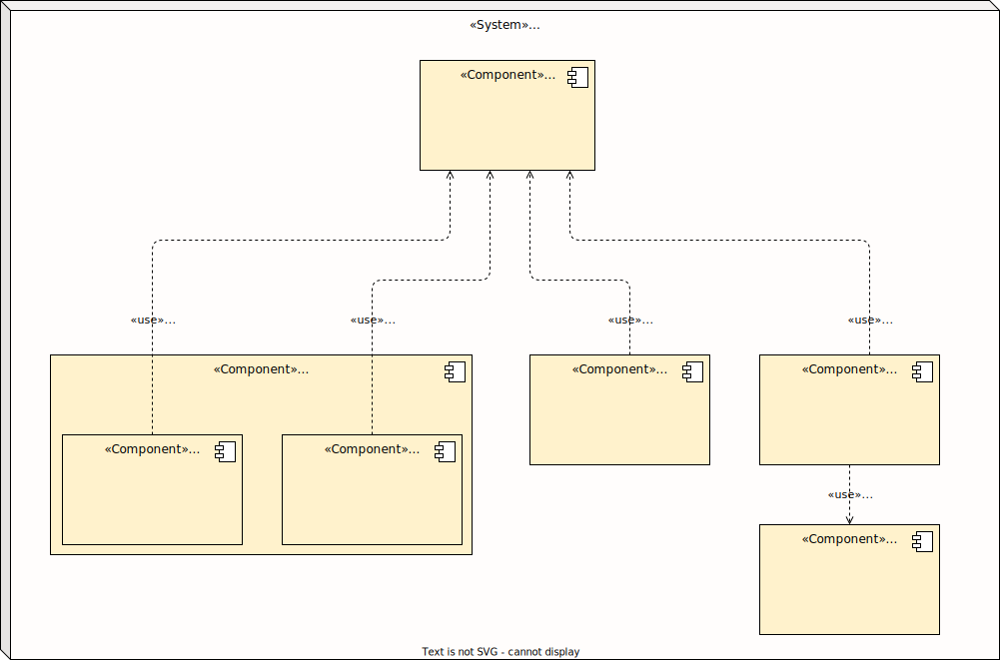
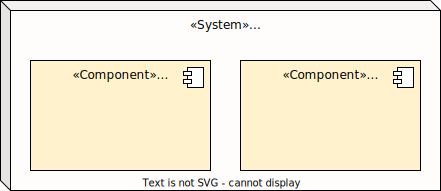

Willkommen in der Architekturdokumentation der WaldorfConnect Plattform!

Ziel des Texts ist es, dem Leser erst einen guten Überblick über das System und was damit erreicht werden soll zu verschaffen.

Dann werden zunächst die wesentlichen Architekturtreiber darstellt. Das sind Ziele oder Faktoren, die die Gestaltung und Entscheidungen bei der Softwarearchitektur maßgeblich beeinflussen. Der Architekturentwurf im darauffolgenden Abschnitt soll diesen Ansprüchen möglichst gerecht werden.

Einige Architekturkonzepte zeigen anschließend, wie bestimmte angestrebte Qualitätsmerkmale erzielt werden und erhöhen das Vertrauen in das System.

Gegen Ende sind dann die großen Design-Entscheidungen inklusive der verworfenen Alternativen dokumentiert, damit nachvollzogen werden kann, warum genau diese Komponenten in der vorliegenden Konstellation eingesetzt werden.

## Inhalt <!-- omit in toc -->

- [Einleitung](#einleitung)
  - [Motivation und Kerntreiber für die Entwicklung des Systems](#motivation-und-kerntreiber-für-die-entwicklung-des-systems)
  - [Ziele, die mit dem System erreicht werden sollen](#ziele-die-mit-dem-system-erreicht-werden-sollen)
  - [Besondere Herausforderugnen](#besondere-herausforderugnen)
  - [Kernfunktionalitäten](#kernfunktionalitäten)
  - [Randbedingungen (Constraints)](#randbedingungen-constraints)
  - [Stakeholder](#stakeholder)
  - [Benutzerrollen](#benutzerrollen)
- [Architekturtreiber (Funktion und Qualität)](#architekturtreiber-funktion-und-qualität)
  - [Wesentliche funktionale Anforderungen](#wesentliche-funktionale-anforderungen)
  - [Qualitätsattribute](#qualitätsattribute)
- [Architektur](#architektur)
  - [Sitemap](#sitemap)
- [Architekturkonzepte](#architekturkonzepte)
  - [Kostenkozept](#kostenkozept)
  - [Datenschutz- und Sicherheitskonzept](#datenschutz--und-sicherheitskonzept)
  - [Verfügbarkeitskonzept](#verfügbarkeitskonzept)
  - [Backupkonzept](#backupkonzept)
- [Design-Entscheidungen \& Verworfene Alternativen](#design-entscheidungen--verworfene-alternativen)
  - [Open Source statt Microsoft Office](#open-source-statt-microsoft-office)
  - [Verworfene Architektur-Alternative: Fork von NextCloud und NextCloud Talk](#verworfene-architektur-alternative-fork-von-nextcloud-und-nextcloud-talk)
  - [Zulip als Team Chat App](#zulip-als-team-chat-app)
  - [Hoster](#hoster)
  - [LDAP Account Manager](#ldap-account-manager)
- [Glossar](#glossar)

## Einleitung

### Motivation und Kerntreiber für die Entwicklung des Systems

- momentan sind Waldorf-Schüler-Vertretungen technisch schlecht unterstützt - sie müssen sich mit Gruppenchats in Messengern wie Signal, Telegram und WhatsApp behelfen und Dateien in privaten Datei-Ablagen speichern und teilen. Informationen sind oft unübersichtlich verstreut. Und die Struktur einer SV mit mehreren AGs unter sich lässt sich in herkömmlichen Messengern nicht geeignet abbilden.
- wünschenswert wäre eine dedizierte Plattform für SV-Arbeit, die alles bereitstellt, was SVen benötigen, und diese sich untereinander vernetzt lässt

### Ziele, die mit dem System erreicht werden sollen

- optimale technische Unterstützung von Waldorf-SVen bei der Arbeit
- mühelose Vernetzung untereinander möglich

### Besondere Herausforderugnen

- Datenschutz, Sicherheit und Transparenz: der Datenschutz muss mindestens den Ansprüchen der DSGVO genügen, die Software muss sicher und vertrauenswürdig (am besten quelloffen) sein
- Kosten: das System soll möglichst nichts kosten, außer dem unbedingt Notwendigen
- Benutzbarkeit und Ästhetik: die Plattform soll einfach, intuitiv und angenehm zu benutzen sein. Es muss sich besser anfühlen als der alte Status Quo.

### Kernfunktionalitäten

> wie auf der Seite `Organisation` beschrieben

- Datei-Speicherung (File Storage)
- Kommunikation (Messaging, Audio- & Video Calls)

### Randbedingungen (Constraints)

- Nutzung von ausschließlich Free (kostenloser) Open-Source Software ("**FOSS**")
- **schnelle** Entwicklung und Bereitstellung (der Bund der FWS fängt in einigen Monaten mit der Planung eines IT-Systems an, das dessen Mitglieder und ggf. auch die Schülervertretungen unterstützen soll. Dies kann Jahre dauern, bedeutet aber, dass WaldorfConnect möglichst kurzfristig  bereitstehen soll, da langfristig der BdFWS seine Plattform in Aussicht stellt.)
- **minimaler Verwaltungsaufwand** ("maintenance") des Systems - das System muss als ehrenamtliche Nebentätigkeit von Schülern wartbar sein

### Stakeholder

- Mitglieder der Waldorf-SVs als Benutzer des Systems (SMVen, LSVen, Bundes-SVen)
- BdFWS als Sponsor

### Benutzerrollen

- Mitglied einer SV
- SV-Admin
- Globaler Admin

 

## Architekturtreiber (Funktion und Qualität)

### Wesentliche funktionale Anforderungen

- Speichern von Dateien in der Cloud
- Abbildung von SVen mit mehreren Arbeitskreisen (AKs) in der Kommunikations-Software
- Chat, Gruppenchat, Audiocall und Videocall Funktionen
- Single-Sign-On mit denselben Zugangsdaten bei allen Apps der Plattform

### Qualitätsattribute

- Funktionale Eignung: das System muss alle wesentlichen funktionalen Anforderungen erfüllen
- Verfügbarkeit: das System sollte eine möglichst hohe Uptime haben
- Leistungseffizienz: das System sollte so schnell reagieren, wie für moderene Webanwendungen üblich
- Benutzbarkeit: das System sollte intuitiv verständlich und nach anfänglicher Einarbeitung schnell und einfach bedienbar sein
- Wartbarkeit: das System sollte nach anfänglicher Entwicklung und Inbetriebnahme möglichst keinen technischen Wartungsaufwand verursachen und nur minimalen organisatorischen Aufwand

 

## Architektur

Abgebildet ist ein Komponentendiagramm, das die Struktur der WaldorfConnect Plattform visualisiert.

Ganz oben befindet sich der LDAP Server `OpenLDAP`, auf dem alle Benutzer und Benutzergruppen mitsamt deren Rechte auf Verzeichnisse gespeichert sind.

Diese Informationen werden vom `Portal` links unten verwaltet. Der normale Benutzer, d.h. Mitglied oder Admin einer SV, kann sich dort einloggen und die Endpunkte des `Simple Account Manager` aufrufen. Die wesentlichen Funktionalitäten dort sind Registrierung, Login, eigene Profilverwaltung und für Admins einer SV auch die Mitgliederverwaltung der eigenen SV. Die komplette Verwaltung des `LDAP Server` können die Globalen Admins (ein Teil des WaldorfConnect Teams) im `LDAP Account Manager` vornehmen.

Bleibt noch der wichtigste Teil der Plattform: der Cloud-Speicher und die Kommunikationssoftware. Cloud-Speicherplatz (Datei-Ablage) steht jeder SV-Einheit in der `NextCloud` Anwendung zur Verfügung. Kommunikation ist in der Open-Source Microsoft-Teams Alternative `Zulip` realisiert. Diese hat intern `Jitsi` für Audio- & Video-Calls integriert.

---

### Sitemap

Die folgende Sitemap (dt.: Seitenübersicht) zeigt, wie das `Portal`, `NextCloud` und `Zulip` über die WaldorfConnect `Homepage` (via Links) erreichbar sind.

Benutzer des Systems werden diese 3 Anwendungen i.d.R. bald als Lesezeichen im Browser speichern (oder durch das Autocomplete des Browsers schneller erreichen), aber für den Anfang und die generelle Erreichbarkeit der Komponenten sind Links auf der Hauptseite sehr wertvoll.

Auf der Homepage sollen dann auch weitere Informationen zur Benutzung und Nachvollziehbarkeit des Systems ausgeschildert sein.

 

## Architekturkonzepte

### Kostenkozept

Minimale Kosten sollen dadurch garantiert werden, dass ausschließlich ein deutscher Server bei einem vertrauenswürdigen Anbieter gemietet wird, um die Plattform bereitzustellen. Dieser soll möglichst günstig sein (einerseits durch sparsame Ressourcenplanung unsererseits, andererseits durch gutes Abschneiden im Vergleich mit anderen Anbietern).

Außer diesen Kosten sollen keine weiteren entstehen: die verwendete Software muss kostenlos und frei verfügbar sein und die Entwickler und Administratoren arbeiten ehrenamtlich.

Dienstleistungen, wie die Erstellung von Grafiken sollen ebenfalls ehrenamtlich von qualifizierten Schülern kommen.

### Datenschutz- und Sicherheitskonzept

Mehrere Faktoren sollen den Datenschutz (inklusive DSGVO-Konformität) und die Sicherheit von WaldorfConnect sicherstellen.

Infrastruktur-Ebene

- Grundlage ist die Wahl eines sicheren deutschen Hosters ([STRATO](https://www.strato.de/sicherheit/)), der jährlich nach der DIN ISO 27001 TÜV-zertifiziert höchste Sicherheitsstandards vorweist und wo das System und dessen Daten in Deutschland sind und bleiben. Er bietet DSGVO-Konformität.

- Die Datenübertragung zu und von diesem Server, auf dem die WaldorfConnect Plattform laufen wird, ist vollständig verschlüsselt, durch SSL-Zertifikate, die STRATO für unsere Domain zur Verfügung stellt.

Anwendungs-Ebene

- Auf Anwendungsverwaltung wird Datenschutz und Sicherheit durch eine zuverlässige Benutzer- und Zugriffsverwaltung hergestellt. Vorgaben hierfür kommen von unserem `LDAP Server` - die Umsetzung erfolgt durch die Anwendungen selbst.

- Die Anwendungen sind sorgfältig ausgewählte Open-Source Software, die ab einer gewissen (hier vorhandenen) Größe bekanntlich sehr sicher sind. Es sollen keine externen Softwarelieferanten oder -anbieter Software genutzt werden.

Benutzer Ebene

- Globale Admins sind nur wenige ausgewählte Personen aus dem WaldorfConnect Projektteam
- SV-Admins müssen für diese Rolle persönlich mit dem WaldorfConnect Team in Kontakt treten und werden hierbei verifiziert
- neue Benutzer können nur von Globalen Admins oder den jeweiligen SV-Admins zu ihrer SV hinzugefügt werden - davor erhalten sie keinerlei Zugriffsrechte

### Verfügbarkeitskonzept

Die Verfügbarkeit der WaldorfConnect Plattform kommt durch die Verfügbarkeit des Servers kombiniert mit der Verfügbarkeit der Anwendungen zustande.

- Die [AGBs von STRATO](https://www.strato.de/agb) garantieren uns mindestens 99% Verfügbarkeit von Servern und Datenwegen im Jahresmittel.
- NextCloud, Zulip und Jitsi sind sehr robust und zuverlässig. (wie fast alle Open-Source Anwendungen von dieser Größe)

### Backupkonzept

Für regelmäßige (wohl tägliche) Backups unseres bei STRATO gemieteten "Linux V-Servers" können wir den [Backupservice von STRATO](https://www.strato.de/faq/server/backup-eines-servers-von-strato/) nutzen.

Falls uns hier der zur Verfügung gestellte Backup-Speicherplatz zu Rande gehen sollte, haben wir die Möglichkeit selbst mithilfe eines Cronjobs regelmäßig Backups vorzunehmen und auf den gemieteten 1.5 TB Speicherplatz abzulegen.

 

## Design-Entscheidungen & Verworfene Alternativen

### Open Source statt Microsoft Office

Microsoft Office bietet die Funktionalitäten an, die die Waldorf-SVen benötigen und noch viel mehr. Die Sturktur mehrerer SVen lässt sich dort ideal abbilden (als "Team"/Gruppe).

Das User Interface und die User Experience entsprechen dem State of the art und sind hervorragend in die Microsoft Teams Anwendung integriert.

Die Benutzerverwaltung bietet alle benötigten Funktionalitäten und viel Anpassbarkeit.

Insgesamt wäre Teams funktional eine perfekte Lösung - aber weder [datenschutzrechtlich](https://www.wbs.legal/it-und-internet-recht/datenschutzrecht/microsoft-365-dsgvo-konformer-einsatz-moeglich-57217/) noch finanziell umsetzbar ([Microsoft Lizenzen als Non-Profit Organisation](https://www.microsoft.com/en-us/nonprofits/eligibility) zu beantragen würde die offizielle Gründung eines Vereins erfordern und der Erfolg des Antrags wäre durch die Nähe zur Schule dann immer noch höchst unsicher).

Deshalb haben wir beschlossen uns nach Open-Source Alternativen umzusehen, die wir selbst, kostengünstig, betreiben können.

### Verworfene Architektur-Alternative: Fork von NextCloud und NextCloud Talk

Die folgende Architektur stand als Alternative zur Diskussion.

Die Idee hier war es NextCloud und NextCloud Talk zu forken, in jeweils eigene Repositories, um dann die nötige Anpassung an der Struktur zu machen (Teams mit untergeordneten Gruppenchats und einer kleinen Administrationsoberfläche für SV-Admins).

**\+ Vorteile**

- Von der Anzahl der Komponenten des Systems ist diese Lösung minimalistisch, da man nur mit NextCloud und NextCloud Talk auskommt (und die eingebaute Benutzer- und Rechteverwaltung verwendet).
- alles ist nahtlos integriert
- konsistente Benutzeroberfläche, optisch sehr ansprechend

**\- Nachteile**

- erfordert potentiell sehr hohen Entwicklungsaufwand (riskant)
- man müsste eine fork von NextCloud maintainen, und von NextCloud Talk, und dann auch allen weiteren Clients: Desktop (Windows, macOS, Linux) und Mobile (Android, iOS) -> enorm aufwendig - so wie das Veröffentlichen all dieser Anwendungen in die jeweiligen App Stores
- Kompatibilität mit NextCloud wäre bei jeder neuen Version gefährdet, Integration des neuen Codes müsste immer wieder manuell unter höchster Vorsicht gemacht werden -> würde viel Testen erfordern

Da diese Lösung umzusetzen unverhältnismäßig großen Aufwand erfordert hätte und enormes Risiko mit sich gebracht hätte, haben wir sie verworfen.

### Zulip als Team Chat App

Als Cloud-Speicher stand von Anfang von NextCloud fest, da es die wohl größte und beliebteste Open-Source Cloud mit den meisten Funktionen ist und das WaldorfConnect Team mit dieser bereits positive Erfahrungen gemacht hat.

Als Chat App bot sich dementsprechend die gut integrierte Erweiterung `NextCloud Talk` an. Diese verhält sich jedoch wie ein ganz normaler Messenger (ähnlich wie Signal, Telegram, WhatsApp). Das bedeutet, dass es nicht möglich ist dort, die hierarchische Struktur einer SV mit mehreren untergeordneten Arbeitskreisen abzubilden. Und dass diese Kanäle ständig störend hoch und runter rutschen würden, je nachdem wo neue Nachrichten da sind.

Der Messaging-Dienst `Mattermost` schied unter anderem aus diesem Grund als Kandidat aus, aber auch weil viele Features blockiert und nur in der kostenpflichtigen und teuren Enterprise-Version verfügbar sind.

Aus denselben zwei Gründen war auch `RocketChat` nicht geeignet (das Synchronisieren einer Benutzergruppe mit einem Gruppenchat warw beispielsweise nur in Premium enthalten, welches 7€ pro Person pro Monat kostet). Außerdem hat `RocketChat` [Probleme mit OAuth](https://github.com/RocketChat/Rocket.Chat.ReactNative/issues/2109) bei den Handy-Apps (Android und iOS).

`Zulip` war schließlich die einzige Software, die unseren Anforderungen an Strukturierung der Chats entspricht, 100% kostenlos und open-source ist (keine blockierten Features), wo OAuth funktioniert und ein eigener LDAP Server integrierbar ist...

### Hoster

Aus Datenschutzgründen kamen prinzipiell alle deutschen Hoster infrage. Mit STRATO hatte ein Teil des WaldorfConnect Teams bereits positive Erfahrungen gemacht. Im Vergleich mit anderen deutschen Hostern (Hetzner, Mittwald,...) schnitt STRATO auch preislich gut ab - daher fiel die Wahl auf diesen.

Letztendlich wurde ein Linux V-Server mit 16GB RAM und 1.500GB SSD für 18€ im Monat ausgewählt, um die gesamte Plattform bereitzustellen.

### LDAP Account Manager

Um LDAP Server zu verwalten, gibt es [verschiedene Clients](https://de.wikipedia.org/wiki/Lightweight_Directory_Access_Protocol#LDAP-Clients). Zuerst sollte phpLDAPadmin installiert werden, weil es vom selben Team wie phpMyAdmin (die wohl meist-verwendedste Webanwendung zur Administration von MySQL-Datenbanken) entwickelt wurde. Allerdings stellt sich heraus, dass das Projekt schon seit einigen Jaharen nicht mehr weiterentwickelt wurde - die Entwickler haben es offenbar aufgegeben.

Deshalb wird hier nun der [LDAP Account Manager](https://de.wikipedia.org/wiki/LDAP_Account_Manager) verwendet.

 

---

## Glossar

- W-*: Präfix und Abkürzung für "Waldorf"
- SV: Schüler-Vertretungen (dass kann die SMV einer Schule sein, die LSV eines Landes, oder die bundesweite SV)
- SMV: Schüermitverwaltung; Schüler-Vertretung einer Schule
- LSV: Landes-Schüler-Vertretung; bestehend aus Vertretern der Schulen eines Bundeslandes oder eines Zusammenschlusses mehrerer Bundesländer (z.B. RheSaLux)
- BdFWS: [Bund der Freien Waldorfschulen](https://www.waldorfschule.de/)
- AK: Arbeitskreis (fortbeständige Arbeitsgruppe innerhalb einer SV)
- LDAP: [Lightweight Directory Access Protocol](https://de.wikipedia.org/wiki/Lightweight_Directory_Access_Protocol)