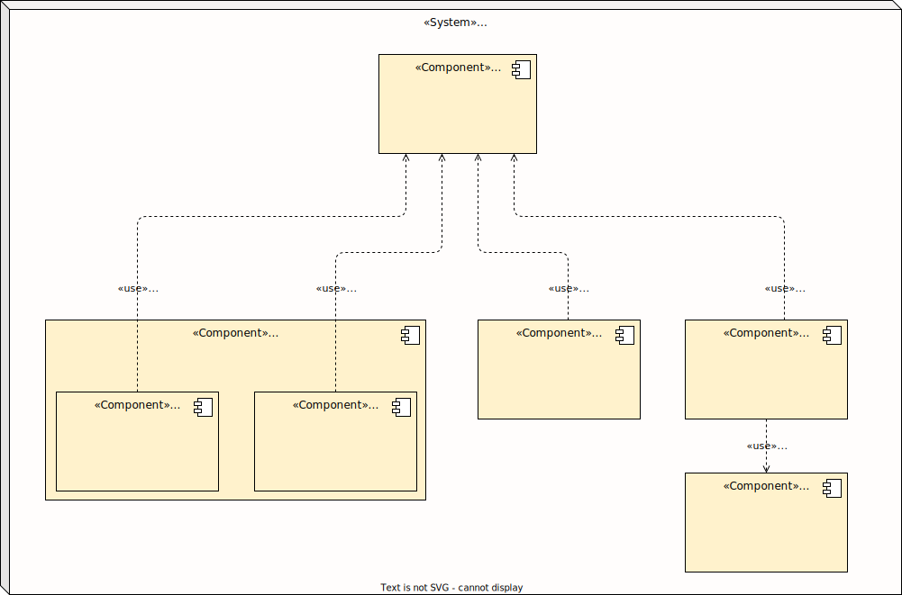

# WaldorfConnect | Dokumentation

Willkommen in der Architekturdokumentation der WaldorfConnect Plattform!

Das Dokument entspricht strukturell einer vereinfachten und angepassten Version des vom [Fraunhofer IESE ](https://de.wikipedia.org/wiki/Fraunhofer-Institut_f%C3%BCr_Experimentelles_Software_Engineering_IESE) entwickelten [Architecture Decomposition Framework (ADF)](https://www.iese.fraunhofer.de/blog/softwarearchitekturen-einfacher-designen-und-verstaendlicher-dokumentieren-mit-dem-fraunhofer-adf/).

Ziel des Texts ist es, dem Leser erst einen guten Überblick über das System - und was damit erreicht werden soll - zu verschaffen.

Die wesentlichen Treiber (Einflussfaktoren) für die Architektur des Systems werden dargestellt. Diese sollen durch den Architekturentwurf im darauffolgenden Abschnitt realisiert werden.

Einige Architekturkonzepte zeigen, wie bestimmte angestrebte Qualitätsmerkmale erzielt werden.

Gegen Ende sind dann sämtliche getroffenen Entscheidungen inklusive der verworfenen Alternativen dokumentiert.

Final steht ein Ausblick in die Zukunft.

## Inhalt <!-- omit in toc -->

- [WaldorfConnect | Dokumentation](#waldorfconnect--dokumentation)
  - [Einleitung](#einleitung)
    - [Motivation und Kerntreiber für die Entwicklung des Systems](#motivation-und-kerntreiber-für-die-entwicklung-des-systems)
    - [Ziele, die mit dem System erreicht werden sollen](#ziele-die-mit-dem-system-erreicht-werden-sollen)
    - [Besondere Herausforderugnen](#besondere-herausforderugnen)
    - [Kernfunktionalitäten](#kernfunktionalitäten)
    - [Randbedingungen (Constraints)](#randbedingungen-constraints)
    - [Stakeholder](#stakeholder)
    - [Benutzerrollen](#benutzerrollen)
  - [Architekturtreiber (Funktion und Qualität)](#architekturtreiber-funktion-und-qualität)
    - [Wesentliche funktionale Anforderungen](#wesentliche-funktionale-anforderungen)
    - [Qualitätsattribute](#qualitätsattribute)
  - [Architektur](#architektur)
  - [Architekturkonzepte](#architekturkonzepte)
    - [Kostenkozept](#kostenkozept)
    - [Datenschutzkonzept](#datenschutzkonzept)
    - [Verfügbarkeitskonzept](#verfügbarkeitskonzept)
    - [Backupkonzept](#backupkonzept)
  - [Design-Entscheidungen \& Verworfene Alternativen](#design-entscheidungen--verworfene-alternativen)
  - [Ausblick und Pläne für die Zukunft](#ausblick-und-pläne-für-die-zukunft)
  - [Glossar](#glossar)

## Einleitung

### Motivation und Kerntreiber für die Entwicklung des Systems

- momentan sind Waldorf-Schüler-Vertretungen technisch schlecht unterstützt - sie müssen sich mit Gruppenchats in Messengern behelfen und Dateien in privaten Datei-Ablagen speichern und teilen. Die relevanten Informationen sind unübersichtlich verstreut und die Struktur von einer SV mit mehreren AGs unter sich ist in Messengern nicht geeignet abzubilden
- wünschenswert wäre eine dedizierte Plattform für SV-Arbeit, die alles bereitstellt, was SVen benötigen, und diese sich untereinander vernetzt lässt

### Ziele, die mit dem System erreicht werden sollen

- optimale technische Unterstützung von Waldorf-SVen bei der Arbeit
- einfache Vernetzbarkeit untereinander

### Besondere Herausforderugnen

- Datenschutz, Sicherheit und Transparenz: alles muss self-hostbar sein + Open-Source
- Kosten: das System sollte möglichst nichts kosten, außer den Betriebskosten der Hardware (d.h. auch keine Drittanbieter-Services nutzen!)
- Benutzbarkeit und Ästhetik: die Plattform soll einfach, intuitiv und angenehm zu benutzen sein. Es soll sich viel besser anfühlen als der alte Status Quo.

### Kernfunktionalitäten

> wie im Dokument `Organisation.md` beschrieben

- Datei-Speicherung (File Storage)
- Kommunikation (Messaging, Audio- & Video Calls)

### Randbedingungen (Constraints)

- Nutzung von ausschließlich Free (kostenloser) Open-Source Software ("**FOSS**")
- **schnelle** Entwicklung und Bereitstellung (der Bund der FWS fängt in einigen Monaten mit der Planung eines IT-Systems an, das dessen Mitglieder und ggf. auch die Schülervertretungen unterstützen soll. Dies kann Jahre dauern, bedeutet aber, dass WaldorfConnect möglichst kurzfristig  bereitstehen soll, da langfristig der BdFWS seine Plattform in Aussicht stellt.)
- **minimaler Verwaltungsaufwand** ("maintenance") des Systems - das System muss als ehrenamtliche Nebentätigkeit von Schülern wartbar sein

### Stakeholder

- Waldorf-SVs als Benutzer des Systems (SMVen, LSVen, Bundes-SVen)
- BdFWS als Sponsor

### Benutzerrollen

- Mitglied einer SV
- SV-Admin
- Globaler Admin

## Architekturtreiber (Funktion und Qualität)

### Wesentliche funktionale Anforderungen

- Speicherung von Dateien in einer Cloud
- Abbildung von SVen mit mehreren Arbeitskreisen (AKs) in der Kommunikations-Software
- Chat, Gruppenchat, Audiocall und Videocall Funktionen
- Single-Sign-On mit denselben Zugangsdaten bei allen Apps der Plattform

### Qualitätsattribute

- Funktionale Eignung: das System muss alle wesentlichen funktionalen Anforderungen erfüllen
- Verfügbarkeit: das System sollte eine möglichst hohe Uptime haben
- Leistungseffizienz: das System sollte so schnell reagieren, wie für moderene Webanwendungen üblich
- Benutzbarkeit: das System sollte intuitiv verständlich und nach anfänglicher Einarbeitung schnell und einfach bedienbar sein
- Wartbarkeit: das System sollte nach anfänglicher Entwicklung und Inbetriebnahme möglichst keinen technischen Wartungsaufwand verursachen und nur minimalen organisatorischen Aufwand

## Architektur

Abgebildet ist ein Komponentendiagramm, das die Struktur der WaldorfConnect Plattform visualisiert.

Das Diagramm zeigt den Link Tree des WaldorfConnect Systems von der Homepage ausgehend: ...

## Architekturkonzepte

### Kostenkozept

<!-- FOSS und so, ehrenamtliche Entwickler, WaldorfConnect Team -->

### Datenschutzkonzept

<!-- Hosting auf deutschem Server -->

### Verfügbarkeitskonzept

<!-- Verfügbarkeit durch garantierte Uptime unserer Hosting Providers STRATO -->

### Backupkonzept

<!-- wir machen mit einem Cronjob regelmäßige Backups des LDAP Servers -->

## Design-Entscheidungen & Verworfene Alternativen

<!-- hier die ganzen Chat-Messenger Alternativen und LDAP Account Manager statt phpMyLDAPAdmin -->

## Ausblick und Pläne für die Zukunft

<!-- bis BdFWS sein Waldorf Plattform rausbringt, das wir damit die SVs ideal technisch in der Arbeit unterstützen und connecten
=>sie entwickeln jetzt mit den möglichkeiten der Plattform richtig gute und effiziente Strukturen, übersichtliche Lösungen/Ressourcenverteilungen
und übernehmen dieses gelernte, diese super Strukturen und Prozesse mit ins neue System

wenn das Syste dann mal kommt, unterstützten wir ggf. die Migration von Daten in  dieses neue System
 -->

---

## Glossar

- W-*: Präfix und Abkürzung für "Waldorf"
- SV: Schüler-Vertretungen (dass kann die SMV einer Schule sein, die LSV eines Landes, oder die bundesweite SV)
- SMV: Schüermitverwaltung; Schüler-Vertretung einer Schule
- LSV: Landes-Schüler-Vertretung; bestehend aus Vertretern der Schulen eines Bundeslandes
- BdFWS: [Bund der Freien Waldorfschulen](https://www.waldorfschule.de/)
- AK: Arbeitskreis (fortbeständige Arbeitsgruppe innerhalb einer SV)